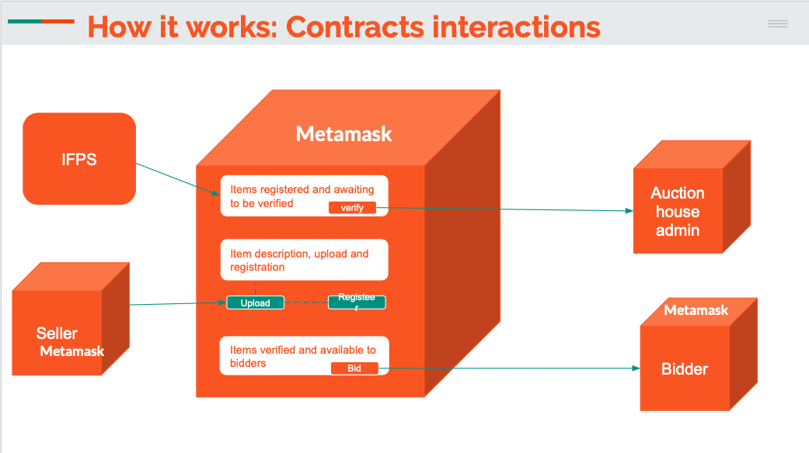
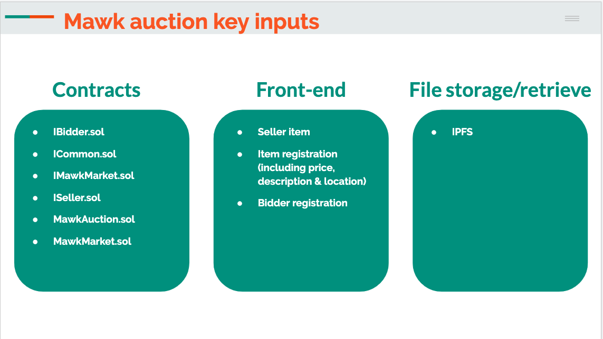

# MAWK Auction dApp Project


Team: Alexis Schottenstein, Keron Edwards, Manpreet Padam, Weijing Wang

- [MAWK Auction dApp Project](#mawk-auction-dapp-project)
  * [dApp Demo](#dapp-demo)
  * [Ethereum Web3](#ethereum-web3)
    + [Features of a contract written in a code-language](#features-of-a-contract-written-in-a-code-language)
    + [What you need to know about smart contracts](#what-you-need-to-know-about-smart-contracts)
    + [Limitations of current auctioning system](#limitations-of-current-auctioning-system)
    + [Benefits of blockchain auctions](#benefits-of-blockchain-auctions)
  * [Downloads & Accounts created](#downloads---accounts-created)
  * [Auction Application Description](#auction-application-description)
    + [Auction Contract Code in Solidity](#auction-contract-code-in-solidity)
- [Futher feature builds of MAWK Auction to include:](#futher-feature-builds-of-mawk-auction-to-include-)
  * [Tokenezation](#tokenezation)
    + [Opportunities that tokenization can bring](#opportunities-that-tokenization-can-bring)
- - -
## dApp Demo
Click [here](https://keronedwards120.github.io/Team-MAWK---Project-3/frontend/index.html) to launch the MawkMarket application.


In our test environment we upload pictures of puppies that can be bid on. We hope in future we could add further data of the animals within the contract structure, for quicker purchasing and verification of breeds and quality. 

- - -
## Ethereum Web3 
Ethereum is a general-purpose blockchain that is more suited to describing business logic, through advanced scripts, also known as smart contracts. Ethereum was designed with a broader vision, as a decentralized or world computer that attempts to marry the power of the blockchain, as a trust machine, with a Turing-complete contract engine. Although Ethereum borrows many ideas that were initially introduced by bitcoin, there are many divergences between the two.

The Ethereum virtual machine and smart contracts are key elements of Ethereum, and constitute its main attraction. In Ethereum, smart contracts represent a piece of code written in a high-level language (Solidity, LLL, Viper) and stored as bytecode in the blockchain, in order to run reliably in a stack-based virtual machine (Ethereum Virtual Machine), in each node, once invoked. The interactions with smart contract functions happen through transactions on the blockchain network, with their payloads being executed in the Ethereum virtual machine, and the shared blockchain state being updated accordingly.

### Features of a contract written in a code-language
1. Universal code-language will be recognized by the computer explicitly 
2. Program code always returns the same result if the input data is the saem. 
3. Contract is signed using a digital signature, which is diffuclt to forge. 
3. There is an opportunity to test such a contract

### What you need to know about smart contracts
1. Smart contracts allow counterparties to interact without having third parties involved. 
2. Smar contracts are easier to audit than traditional contracts
3. There are different types of smart contract protocols and different implementation methods. 
4. They allow the management of digitial assests that are stored ona specific platform. 
5. Initiation of the contract can be performedd either manually or automatically. 

### Limitations of current auctioning system
1. Auctions are not transparent. 
    -   Bidders have no way to ensure the origin, authenticity and legitimacy of a higher bid. Only the organizer has this information
2. Auctions are not open
    -   Every bidder must use the organizer’s platform for registration,       authentication and bidding. So, as there are a huge number of auction organizers worldwide, a bidder must register many times over.
3. The auction ecosystem is very limited
    - Because no one standard exists, each organizer has developed its own bidder interface and tools. But this proliferation has brought quality down. For instance, most auction organizers don’t have a mobile application — or if they do, the app is not user-friendly. Similarly, it is almost impossible to find associated auction services even though there is a high level of interest from buyers for services ranging from purchase finance to delivery.

### Benefits of blockchain auctions
1. Payments are guaranteed via deposit
2. Delivery guaranteed
3. Fast… higher bids are validated in less than a second
4. No cancellation
5. Scalable, reliable and transparent: thanks to the distributed repository protocol, each operation will be registered within the network in a way that is transparent, publicly verifiable and virtually impossible to falsify.


## Downloads & Accounts created
- Remix - we recommend installing locally verus only using the online version that does not allow to save files as you are working. [download instructions](https://medium.com/coinmonks/setting-up-remix-ide-for-solidity-development-1a30f227b600)
- Metamask - [Website](https://metamask.io/)
- Piniata Account [Website](https://pinata.cloud/)
- Test Ether -  [Ropsten Faucet](https://faucet.ropsten.be/) you can test on any desired network or locally using ganache. 
- Ganache - [Website](https://www.trufflesuite.com/ganache)

## Auction Application Description
- - -

The backend layer is considered first, represented by the smart contract that manages the auction, while conected to Web3 front-end we utilize Remix in this example to compile and deploy via metamask. However, there are alternative platforms to test and deploy, including truffle suite and ganache. As well as via visual studio code with their marketplace add-on. We found Remix as an unsifficient editor during the writing of the code. 

In our work flow, An owner of of good, whether physical or not, usues our dApp front-end (using javascript and html) to upload an image and any other descriptions (features to implement in future releases)to sell to the public. The owner deploys the contract to the blockchain and becomes the auction owner. The auction is open after the auction house *verifies* the good via the front-end interface. once the bidding period is over, the highest bidder wins the auction, and the other participants withdraw their bids and can do so in real-time. In this example, the bid must outbid the previous bidder. If 100ETH is bid 101ETH must be bid to become the highest bidder. 

Furthermore, the auction owner can cancel the auction in exceptional cases, and must also be allowed, at the end of the auction, to withdraw the winning bid. The auction interaction flow is illustrated in the following diagram:




### Auction Contract Code in Solidity 
- - -
To write our auction contract, we will use Solidity, which is the most popular language used to write smart contracts for the Ethereum blockchain. It's a JavaScript-like language, compiled into bytecode running in the Ethereum virtual machine. If you are familiar with Object-Oriented Programming, learning to write Solidity contracts should be fairly straightforward. Through this auction example, I'll try to lay out the basic and important features of Solidity.

Our contract design will be simple. In the first step, we will create an abstract contract, in which we will declare our elementary functions and events. Then, we will use inheritance to create a compliant implementation—a contract with the exact same functions implemented. Abstract contracts help us to decouple the definition of a contract from its implementation, providing better extensibility and code readability.


<details>
  <summary>Contract Code</summary>
``` solidity
pragma solidity >=0.5.0;

contract MartianAuction {
    address payable public beneficiary;

    // Current state of the auction.
    address public highestBidder;
    uint public highestBid;

    // Allowed withdrawals of previous bids
    mapping(address => uint) pendingReturns;

    // Set to true at the end, disallows any change.
    // By default initialized to `false`.
    bool public ended;
    bool public verified;

    // Events that will be emitted on changes.
    event HighestBidIncreased(address bidder, uint amount);
    event AuctionEnded(address winner, uint amount);

    // The following is a so-called natspec comment,
    // recognizable by the three slashes.
    // It will be shown when the user is asked to
    // confirm a transaction.

    /// Create a simple auction with `_biddingTime`
    /// seconds bidding time on behalf of the
    /// beneficiary address `_beneficiary`.
    constructor(
        address payable _beneficiary
    ) public {
        beneficiary = _beneficiary;
    }

    /// Bid on the auction with the value sent
    /// together with this transaction.
    /// The value will only be refunded if the
    /// auction is not won.
    function bid(address payable sender) public payable {
        // If the bid is not higher, send the
        // money back.
        require(
            msg.value > highestBid,
            "There already is a higher bid."
        );

        require(!ended, "auctionEnd has already been called.");

        if (highestBid != 0) {
            // Sending back the money by simply using
            // highestBidder.send(highestBid) is a security risk
            // because it could execute an untrusted contract.
            // It is always safer to let the recipients
            // withdraw their money themselves.
            pendingReturns[highestBidder] += highestBid;
        }
        highestBidder = sender;
        highestBid = msg.value;
        emit HighestBidIncreased(sender, msg.value);
    }

    /// Withdraw a bid that was overbid.
    function withdraw(address payable bidder) public {
        uint amount = pendingReturns[bidder];
        if (amount > 0) {
            // It is important to set this to zero because the recipient
            // can call this function again as part of the receiving call
            // before `send` returns.
            bidder.transfer(amount);
            pendingReturns[bidder] = 0;
        //     if (!msg.sender.send(amount)) {
        //         // No need to call throw here, just reset the amount owing
        //         pendingReturns[msg.sender] = amount;
        //         return false;
        //     }
        }
    }

    function pendingReturn(address sender) public view returns (uint) {
        return pendingReturns[sender];
    }
    
    function verify() public {
        verified=true;
    }
    
    function verifycheck() public view returns (bool){
        return verified;
    }

    /// End the auction and send the highest bid
    /// to the beneficiary.
    function auctionEnd() public {
        // It is a good guideline to structure functions that interact
        // with other contracts (i.e. they call functions or send Ether)
        // into three phases:
        // 1. checking conditions
        // 2. performing actions (potentially changing conditions)
        // 3. interacting with other contracts
        // If these phases are mixed up, the other contract could call
        // back into the current contract and modify the state or cause
        // effects (ether payout) to be performed multiple times.
        // If functions called internally include interaction with external
        // contracts, they also have to be considered interaction with
        // external contracts.

        // 1. Conditions
        require(!ended, "auctionEnd has already been called.");
        //require(msg.sender == beneficiary, "You are not the auction beneficiary");

        // 2. Effects
        ended = true;
        emit AuctionEnded(highestBidder, highestBid);

        // 3. Interaction
        beneficiary.transfer(highestBid);
    }
}

``` 


``` solidity 
pragma solidity >=0.4.22 <=0.6.0;

import "https://github.com/OpenZeppelin/openzeppelin-contracts/blob/master/contracts/token/ERC721/ERC721Full.sol";
import "https://github.com/OpenZeppelin/openzeppelin-contracts/blob/master/contracts/ownership/Ownable.sol";
import "./MartianAuction.sol";

contract MartianMarket is ERC721Full, Ownable {

    constructor() ERC721Full("MartianMarket", "MARS") public {}

    using Counters for Counters.Counter;

    Counters.Counter token_ids;

    address payable foundation_address = msg.sender;

    mapping(uint => MartianAuction) public auctions;

    modifier landRegistered(uint token_id) {
        require(_exists(token_id), "Land not registered!");
        _;
    }
    
    //event RegisterItem (uint token_id, address owner, string uri);
    event Verify(uint token_id);

    function registerLand(string memory uri) public payable {
        token_ids.increment();
        uint token_id = token_ids.current();
        _mint(msg.sender, token_id);
        _setTokenURI(token_id, uri);
        createAuction(token_id);
        //emit RegisterItem(token_id, msg.sender, uri);
    }

    function createAuction(uint token_id) public  {
        auctions[token_id] = new MartianAuction(foundation_address);
    }

    function endAuction(uint token_id) public onlyOwner landRegistered(token_id) {
        MartianAuction auction = auctions[token_id];
        auction.auctionEnd();
        safeTransferFrom(owner(), auction.highestBidder(), token_id);
    }

    function auctionEnded(uint token_id) public view returns(bool) {
        MartianAuction auction = auctions[token_id];
        return auction.ended();
    }

    function highestBid(uint token_id) public view landRegistered(token_id) returns(uint) {
        MartianAuction auction = auctions[token_id];
        return auction.highestBid();
    }

    function pendingReturn(uint token_id, address sender) public view landRegistered(token_id) returns(uint) {
        MartianAuction auction = auctions[token_id];
        return auction.pendingReturn(sender);
    }

    function bid(uint token_id) public payable landRegistered(token_id) {
        MartianAuction auction = auctions[token_id];
        auction.bid.value(msg.value)(msg.sender);
    }
    
    function withdraw (uint token_id) public {
        MartianAuction auction = auctions[token_id];
        auction.withdraw(msg.sender);
    }
    
    function verify (uint token_id) public onlyOwner {
        MartianAuction auction = auctions[token_id];
        auction.verify();
        emit Verify(token_id);
    }
    
    function verifycheck (uint token_id) public view returns (bool){
        MartianAuction auction = auctions[token_id];
        return auction.verifycheck();
    }
}

``` 

</details>


# Futher feature builds of MAWK Auction to include:

Having built the proof of concept we invision further features to the application to include:
1. Tracking of goods and further verficiation in shipment of winning bids. 
2. Allowing donations to be given for tracking and distribution purproses in times of criss. 
3. Further verifications in place via IFPS & NLP to establish shipping orders and aid in supply chain management. 
4. Build the front-end marketplace that includes cross boarder payments, 

## Tokenezation 

By establishing our own coin and allows owners to create their own tokens to transact their goods on, this way we are reaching a wider network of participants. They can then further transact without the fear of malicious acts and create a network of consensus, that meet the business needs of each industry and stabilizes cost.

### Opportunities that tokenization can bring
1. Creating gloabl dentralized data registries 
2. Creaging closely integrates systems with high modularity and distribution of operational responsibility 
3. Real-time and simple audit of an accounting system 
4. Moving and trading assets on the Internet that has no borders(the possibility to creathe the Financial Internet)


